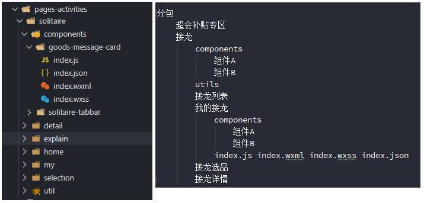

# 小程序相关小分享

## 1.创建文件

### 文件结构

> 递归思维。



分包
超会补贴专区
接龙
components
组件 A
组件 B
utils
接龙列表
我的接龙
components
组件 A
组件 B
test.js index.wxml index.wxss index.json
接龙选品
接龙详情

> 文件结构保持分离性和聚合性
>
> 分离：非同类型页面互不干扰
>
> 聚合：同类型页面保持放在一起
>
> A 需要苹果，把苹果放在 A 手里。A 和 B 都需要苹果，把苹果放在桌子上。
>
> 参考省市县联动。

### 分包

## 2.快速开发一个 list 页面

- tab 切换（频繁点击需要考虑）
- 分页
- 下拉刷新
- 无数据状态


> index.js 页面

```js
import { http } from '../../../utils/util';

// 是否正在请求中
let requesting = false;
// 每页的数量
let pageSize = 15;
// 当前页码
let page = 1;

Page({
  /**
   * 页面的初始数据
   */
  data: {
    // 当前选中的类型
    typeChecked: 30,
    // 所有的类型list，使用 data 定义，比 xml 写死更方便扩展
    typeList: [
      { value: 30, label: '溯源活动' },
      { value: 20, label: '线下活动' },
    ],
    // 列表list数据
    traceabilityList: [
      {
        formId: 23452354,
        status: 1,
        approveStatus: 1,
        coverPicture: 'https://img.ixiaocong.com/image/activity/e0a90aa8910e4d39969a4132639d7d58.jpg',
      },
    ],
    // 是否有更多数据
    hasMore: true,
    // 判断是否为初始请求，防止第一次进入页面 list.length 为 0 而显示 no-data.png 的情况
    initPage: true,
    // 请求是否完成
    // 之所以定义两个，是因为使用 js 内存的变量判断逻辑更简单、快捷、且不涉及更新机制的问题。
    requestLoading: false,
  },
  // 切换类型选择
  changeType(e) {
    let type = e.currentTarget.dataset.type;
    // 在激活菜单点击自身，不可以做重复处理
    if (this.data.typeChecked === type) {
      return;
    }
    if (requesting) {
      wx.showToast({
        title: '请不要频繁点击哦',
        icon: 'none',
      });
      return;
    }
    // 切换类型需要恢复变量的初始值
    page = 1;
    this.setData({
      initPage: true,
      hasMore: true,
      traceabilityList: [],
      typeChecked: type,
    });
    this.findMsgList();
  },
  // 初始化查询
  findMsgList() {
    // 默认日期为1970年
    // 此行无用
    let lastCreated = +new Date();

    // 参数写在外层，而不写在http的那行代码中，利于扩展，且更清晰
    let params = {
      pageSize: pageSize,
      pageIndex: page,
      displayType: this.data.typeChecked,
      lastCreated,
    };
    // 设置请求状态 为请求中
    this.setData({
      requestLoading: true,
    });
    requesting = true;

    // 开始请求
    http('/msc/msgs/list', params)
      .then((res) => {
        if (res.success) {
          // 下拉刷新的时候需要重置数据，所以加此判断
          let oldList = this.data.initPage ? [] : this.data.traceabilityList;

          // 防止后端返回 null
          let newList = res.data.records || [];

          // 根据返回的长度判断是否还有下一页
          if (newList.length < pageSize) {
            this.setData({ hasMore: false });
          }
          // 将新数据添加进去
          for (let item of newList) {
            // 此处使用循环而不使用 concat 的原因是：有些新数据需要在此进行处理
            // 例如：日期的格式化、文字的拼接、字符串转array、数值计算 等等
            // methods
            oldList.push(item);
          }
          this.setData({
            traceabilityList: oldList,
          });
        }

        /* 无论成功、失败都需要进行的处理 begin */
        /* 可以抽离成方法，如果支持 finally 的写法，需要写在finally中，当前小程序基础包版本不支持此语法  */
        this.setData({
          requestLoading: false,
          initPage: false,
        });
        requesting = false;
        wx.stopPullDownRefresh();
        /* 无论成功、失败都需要进行的处理 end */
      })
      .catch((err) => {
        console.log(err);

        /* 无论成功、失败都需要进行的处理 begin */
        /* 可以抽离成方法，如果支持 finally 的写法，需要写在finally中，当前小程序基础包版本不支持此语法  */
        this.setData({
          requestLoading: false,
          initPage: false,
        });
        requesting = false;
        wx.stopPullDownRefresh();
        /* 无论成功、失败都需要进行的处理 end */
      });
  },
  /**
   * 转溯源详情
   * @param e
   */
  goTraceabilityDetail(e) {
    let traceability = e.currentTarget.dataset.item;
    let formId = traceability.formId;
    wx.navigateTo({
      url: `/my/traceability/detail/index?formId=${formId}`,
    });
  },
  /**
   * 页面上拉触底事件的处理函数
   */
  onReachBottom() {
    this.loadMore();
  },
  /*
   * 加载更多
   */
  loadMore() {
    // 首选判断请求中，在判断是否有下一页，去除无用请求
    if (requesting || !this.data.hasMore) {
      return;
    }
    page++;
    this.findMsgList();
  },
  /**
   * 生命周期函数--监听页面加载
   */
  onLoad(options) {},

  /**
   * 生命周期函数--监听页面初次渲染完成
   */
  onReady() {},

  /**
   * 生命周期函数--监听页面显示
   */
  onShow() {
    // js Page外层定义的变量需要复原。
    // 原因： 页面顶层定义的变量会在js加在的时候就渲染上，跳入其他页面在回来的时候，变量会发生保存的情况。
    requesting = false;
    page = 1;
    // 重新进入了页面，所以需要重新设置 initPage 状态
    this.setData({ initPage: true });
    this.findMsgList();
  },

  /**
   * 生命周期函数--监听页面隐藏
   */
  onHide() {},

  /**
   * 生命周期函数--监听页面卸载
   */
  onUnload() {},

  /**
   * 页面相关事件处理函数--监听用户下拉动作
   */
  onPullDownRefresh() {
    // 此处其实会发生一个小bug，在上次请求1进行中的时候，触发下拉刷新请求2，页面如果2比1快会渲染1的数据。
    page = 1;
    this.setData({ initPage: true });
    this.findMsgList();
  },
});
```

> index.wxml 页面

```html
<view>
  <!--选项卡-->
  <view class="traceability-type">
    <view class="traceability-type-list">
      <view
        wx:for="{{typeList}}"
        wx:key="unique"
        class="traceability-type-item {{typeChecked === item.value ? 'checked' : ''}}"
        data-type="{{item.value}}"
        bindtap="changeType"
        >{{item.label}}
      </view>
    </view>
  </view>
  <!--空数据的时候，显示无数据图片，双层检验，不会发生错误-->
  <block wx:if="{{ !initPage && traceabilityList.length === 0}}">
    <view class="list-no-data">
      <image src="/static/img/no-data.png" mode="widthFix"></image>
      <view>暂时没有活动哦~</view>
    </view>
  </block>
  <!--list页面-->
  <block wx:else>
    <view class="traceability-list">
      <!--每一个item-->
      <!--使用block的原因，block不属于真实标签，可以使页面结构更清晰-->
      <block wx:for="{{traceabilityList}}" wx:key="unique">
        <view class="traceability-item" bindtap="goTraceabilityDetail" data-item="{{item}}">
          <oss-img class="ti-img" mode="aspectFill" src="{{item.coverPicture}}" data-src="{{item.coverPicture}}" />
          <!--<image class="ni-img"
                           mode="aspectFill"
                           src="{{item.coverPicture}}"
                           data-src="{{item.coverPicture}}"/>-->
          <block wx:if="{{item.status === 0}}">
            <view class="ti-label">已结束</view>
          </block>
          <block wx:if="{{item.status === 1}}">
            <view class="ti-label" wx:if="{{item.approveStatus === 1}}">审核通过</view>
            <view class="ti-label" wx:if="{{item.approveStatus === 0}}">审核中</view>
            <view class="ti-label" wx:if="{{item.approveStatus === -1}}">审核拒绝</view>
          </block>
        </view>
      </block>
      <wxc-loadmore wx:if="{{requestLoading}}" text="加载中..." icon="{{true}}" />
      <wxc-loadmore wx:if="{{traceabilityList.length > 0 && !hasMore}}" is-end="{{true}}" text="到底啦~" />
    </view>
  </block>
</view>
```

## 3.小程序小坑点

[小程序问题总结.md](http://note.youdao.com/noteshare?id=3c477b5e068bd583fad98aec59dcfb2f&sub=0818F57AFC28408F94F0F5DDB1AF93B8)

## 4.小程序小技巧

### ① 多表单类型的写法

> 对于多输入框的 bindinput 绑定，可以配合使用 data-name，避免写一堆重复性的时间

```
bindinput="inputChange"
inputChange(e){
    let key = e.currentTarget.dataset.name
    this.setData({
        [key]:e.detail.value
    })
}
```

> 同理，同类型的多点击事件也可以采用才操作
