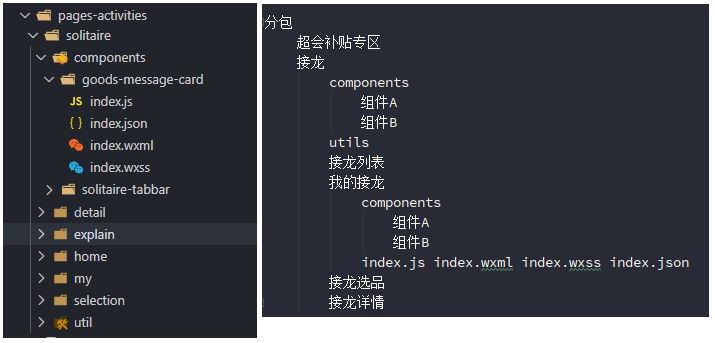

小程序相关小分享。

## 1、创建文件

### 文件结构

> 递归思维。



分包
    超会补贴专区
    接龙
        components
            组件A
            组件B
        utils
        接龙列表
        我的接龙
            components
                组件A
                组件B
            test.js index.wxml index.wxss index.json
        接龙选品
        接龙详情

> 文件结构保持分离性和聚合性
>
> 分离：非同类型页面互不干扰
>
> 聚合：同类型页面保持放在一起
> 
> A需要苹果，把苹果放在A手里。A和B都需要苹果，把苹果放在桌子上。
>
> 参考省市县联动。

### 分包

## 2、快速开发一个list页面

- tab切换（频繁点击需要考虑）
- 分页
- 下拉刷新
- 无数据状态


[index.js页面](./test.js) 

[index.wxml页面](./test.wxml) 


## 3、小程序小坑点

[小程序问题总结.md](http://note.youdao.com/noteshare?id=3c477b5e068bd583fad98aec59dcfb2f&sub=0818F57AFC28408F94F0F5DDB1AF93B8)

## 4、小程序小技巧

### ① 多表单类型的写法
> 对于多输入框的bindinput绑定，可以配合使用data-name，避免写一堆重复性的时间
```
bindinput="inputChange"
inputChange(e){
    let key = e.currentTarget.dataset.name
    this.setData({
        [key]:e.detail.value
    })
}
```
> 同理，同类型的多点击事件也可以采用才操作
